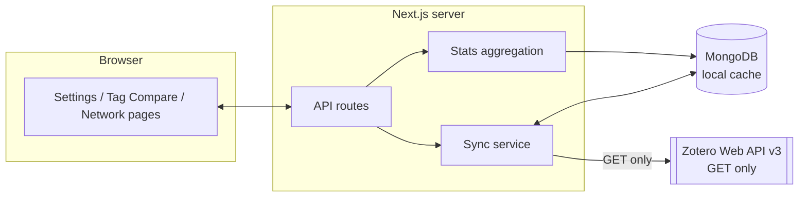
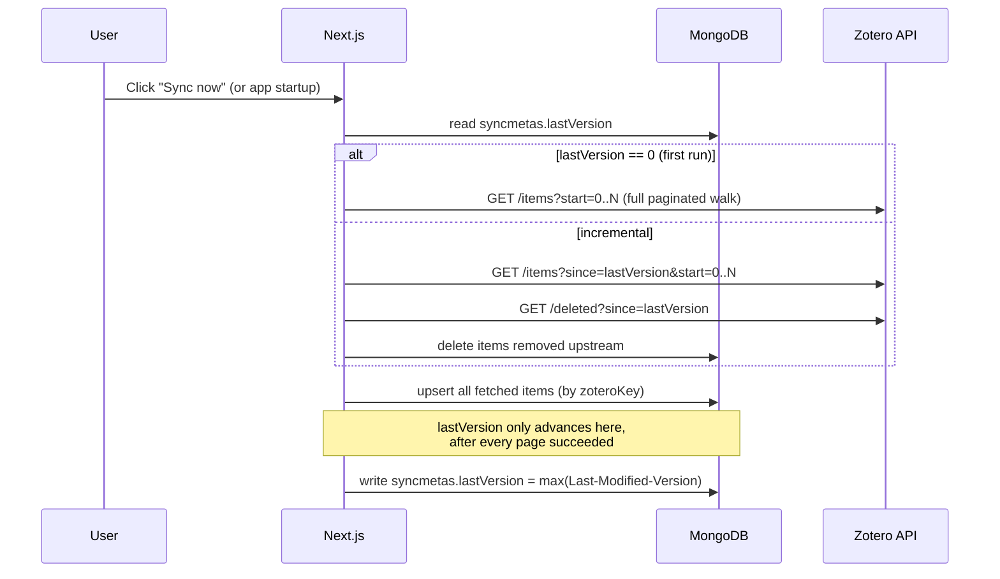
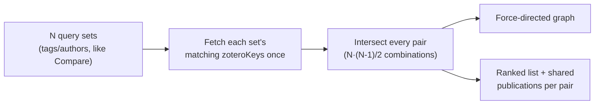

# Architecture

## Overview

ZoteroSciStats is a single-user, locally-run Next.js app. It syncs a Zotero
library into a local MongoDB cache and computes tag/date statistics from
that cache — it never queries Zotero live on every page view, and it never
writes back to Zotero.



## Read-only guarantee

This is enforced at two independent layers:

1. **Zotero-side**: you create an API key scoped to read-only access (see
   [INSTALL.md](INSTALL.md#5-create-a-read-only-zotero-api-key)). Even a
   compromised or buggy client can't write with that key.
2. **Code-side**: [`lib/zotero/client.ts`](lib/zotero/client.ts) is the only
   module in this codebase that talks to `api.zotero.org`, and it exposes
   `GET`-only functions. There is no `POST`/`PUT`/`DELETE` call anywhere in
   this repository targeting the Zotero API — nothing to accidentally wire
   up even with a fully-privileged key.

## Data model (MongoDB)

| Collection  | Purpose                                                                 |
| ----------- | ------------------------------------------------------------------------ |
| `configs`   | Singleton: the connected library (API key, library id/type/name).       |
| `items`     | One document per Zotero item — the sync cache. See [`Item.ts`](lib/db/models/Item.ts). |
| `syncmetas` | One document per library: last synced Zotero library version, status, item count, last-run duration/bytes/added/updated/deleted. |
| `comparisonruns` | History of comparisons run on the Compare page (the query sets used + the computed stats), newest 20 per library. Lets past comparisons stay on the page across reloads. |
| `savedquerys` | Reusable named query sets (tags, tag mode, year range). Not required for the UI to work — the Compare page also works with ad-hoc, unsaved query sets. |

`items.publicationYear` and `items.publicationDate` are both parsed once
at sync time from Zotero's free-text `date` field
([`lib/zotero/parseDate.ts`](lib/zotero/parseDate.ts)); `items.creatorNames`
is a flattened `["First Last", ...]` list derived from `items.creators`.
All three exist so filtering is a plain indexed query instead of parsing
data on every request:

- `publicationYear` groups the by-year bar chart.
- `publicationDate` is a real `Date`, used for the day-precision date-range
  filter. Zotero dates vary wildly in precision ("2026", "2026-03",
  "2026-03-14", "March 2026", ...); missing month/day are normalized to
  the 1st, so a partial date still falls inside a sensible range (e.g. a
  bare "2026" becomes 2026-01-01, which a 2026-01-01..2026-12-31 filter
  correctly catches).

`items.raw` keeps the complete original Zotero item payload, which is what
lets all of these derived fields be recomputed later without a re-sync
(see "Reprocessing" below), and is also what the APA citation formatter
reads (volume/issue/pages/publisher/etc. aren't modeled as their own
fields).

## Sync strategy

Zotero's Web API versions every library: each response carries the current
`Last-Modified-Version`, and requests accept a `since=<version>` parameter
that returns only items changed after that version.



**Why this order matters for reliability:** if any page fails partway
through (network error, rate limit), the run's exception handler records
`status: "error"` but leaves `lastVersion` untouched. The next sync attempt
- full or incremental - simply retries the same window; because item
upserts are keyed by `zoteroKey`, replaying a page is a no-op for items
already stored. There is no scenario where a partial failure silently
skips items.

Sync is currently triggered **manually** via the Sync button on the
Settings page (`POST /api/sync`); an automatic on-startup check is a
natural future addition (see below) but isn't wired up yet.

Each run reports, and persists onto `syncmetas`: wall-clock **duration**,
the approximate **bytes** of item payload pulled from Zotero, and how many
items were **added** / **updated** / **deleted** (from the `bulkWrite`
result's `upsertedCount`/`modifiedCount`, and the deleted-items call's
count). The Settings page also shows the cache's **current on-disk size**
independently of any of that (`getCacheSizeBytes` in
[`lib/stats/aggregate.ts`](lib/stats/aggregate.ts), via MongoDB's
`$bsonSize`) - this is always available, even for a library that was
synced before this metric existed.

### Reprocessing without re-syncing

`items.raw` has held the complete Zotero item payload since the very
first sync. That means any *new* derived field - like `creatorNames`,
added for author filtering - can be backfilled onto an already-synced
library purely from what's already in MongoDB, with zero Zotero API
calls: [`lib/zotero/reprocess.ts`](lib/zotero/reprocess.ts) walks every
stored item and recomputes derived fields from `raw`. This is exposed as
its own "Reprocess cache" action on the Settings page
(`POST /api/reprocess`), separate from Sync, specifically so a large
existing library doesn't need a full re-sync just to pick up a new
derived field.

## Filtering & comparison

A "query set" (`MatchFilter` in [`lib/stats/aggregate.ts`](lib/stats/aggregate.ts)) is:

```ts
{
  tags: string[]; tagMode: "AND" | "OR";
  authors?: string[]; authorMode?: "AND" | "OR";
  excludedItemTypes?: string[]; // types the user unchecked; empty/absent = all types
  dateFrom?: string | null; dateTo?: string | null; // ISO "YYYY-MM-DD"
}
```

Tags and authors are what distinguish one query set from another; the
date range and publication-type filter describe the *scope of the whole
comparison* ("2020-2025, peer-reviewed only") and are edited exactly once,
in [`GlobalFilterBar.tsx`](components/GlobalFilterBar.tsx) - not per set.
When a comparison is submitted, the same `excludedItemTypes`/`dateFrom`/
`dateTo` values are copied onto every query set's payload, so the wire
format sent to `POST /api/stats` and stored in comparison history is
unchanged; only the editor UI is centralized.

The Compare/Network pages send one or more `MatchFilter`s to their
respective endpoints, which run a MongoDB aggregation per set via the
shared `buildItemMatch`:

- `tagMode`/`authorMode` `"AND"` → `{ $all: [...] }`, `"OR"` → `{ $in: [...] }`,
  matched against `tags` / `creatorNames` respectively.
- `excludedItemTypes` → `{ itemType: { $nin: [...] } }`. Deliberately an
  *exclusion* list rather than an inclusion one: the UI only ever needs to
  know what the user unchecked, never the full universe of types that
  exist, so there's nothing to keep in sync client-side and no ambiguity
  between "no filter" and "filtered down to nothing" - an empty exclusion
  list naturally means everything is included, and excluding every known
  type naturally matches nothing.
- `dateFrom`/`dateTo` → `{ publicationDate: { $gte, $lte } }`, day-precision.
  `GlobalFilterBar` uses native `<input type="date">` fields (which get a
  proper calendar/date-wheel picker on both desktop and mobile for free),
  plus "+1 month"/"+1 year" buttons that shift the end date relative to
  the start date - both client-side convenience only, no new endpoints.
  `spanEndFromIsoDate` computes that end date as one day *before* the same
  date a month/year later (2025-01-01 + 1 year → 2025-12-31, not
  2026-01-01) - the naive version was a real bug: landing on the same
  calendar date a year later is already one day into the next year's
  publications, so a "2025" range built from it would silently pull in a
  stray 2026-01-01 item.

The publication-type filter is rendered as two inline, wrapped checkbox
groups - "peer-reviewed" (journal articles + conference papers) and
"other" (everything else) - per
[`lib/zotero/itemTypes.ts`](lib/zotero/itemTypes.ts). That split is a
pragmatic default the app imposes, not something Zotero's data model
itself records. Each group's label is itself a toggle (select/deselect
everything in that group), alongside a global select-all/deselect-all
pair.

### Faceted suggestions

Each query-set card ([`QuerySetEditor.tsx`](components/QuerySetEditor.tsx))
owns its own tag/author suggestions, fetched from `POST /api/facets` and
re-fetched whenever that card's tags/authors or the shared publication-type
filter change. The suggestions are scoped to the card's *other* active
filters - e.g. narrowing the shared filter to "Conference Paper" also
narrows which tags and authors show up as options for every card, matching
what the chart/table would show, not the whole library. Each facet
excludes its own field from the match it computes against (`computeFacets`
in `lib/stats/aggregate.ts` calls `buildItemMatch` three times, each time
zeroing out one axis), so picking a tag doesn't hide itself from the tag
dropdown. `GlobalFilterBar` calls the same endpoint (with empty
tags/authors) to get live item-type counts.

**The date range is deliberately excluded from every facet match.** Tags,
authors, and item types are a library-wide vocabulary; a tag having zero
matches within the currently selected date range is a fact the results
show (a legitimate "0"), not a reason to make it vanish from the
suggestion list - a tag that disappears and reappears as you adjust dates
reads as broken, not as "filtered." `computeFacets` builds every facet's
match from `{ ...filter, dateFrom: undefined, dateTo: undefined }` for
exactly this reason.

This replaced the earlier flat, page-wide `/api/tags` + `/api/authors` +
`/api/item-types` endpoints, which always listed the whole library
regardless of what was already filtered.

Each query set returns a total count, a per-year breakdown (for the bar
chart), a per-item-type breakdown (for the table - rendered with each
cell's share of that *column's* total in brackets, e.g. "13 (39%)" meaning
13 of all journalArticle hits across every query set, not 13 of that row's
own total, plus a `<tfoot>` total row summing every query set and item
type), and up to 150
items formatted as APA-style references
([`lib/citations/apa.ts`](lib/citations/apa.ts), reading container
title/volume/issue/pages/publisher out of `items.raw`). APA was chosen
over IEEE specifically for its author list: up to 20 authors are named in
full before truncating (first 19 + ellipsis + last author), vs. IEEE's
much shorter ~6-author cutoff - relevant for the multi-author, often
large-team publications typical of this kind of institute reporting.
Because everything reads from the local cache, adding more query sets to
a comparison is cheap.

Facet suggestions (see above) are ranked by how many items use them and
drop values used by fewer than 2 items - this only declutters the
suggestion list, free-text entry still accepts anything.

### Comparison history

Every run of the Compare page is saved to `comparisonruns`
(`POST /api/comparisons`) with both the query sets used and the computed
stats, and the last 20 per library are listed on page load
(`GET /api/comparisons`) - so past comparisons remain visible across
reloads without recomputing anything. Each history entry can be reloaded
back into the editor for tweaking, or deleted (`DELETE /api/comparisons/{id}`).

Multiple history entries can be expanded at once - `expandedIds` is a
`Set<string>`, not a single id, and running a new comparison only *adds*
its id to that set rather than replacing it. Collapsing whatever the user
already had open just because they ran something new would throw away
context they were actively comparing against.

## Collaboration network

A second, separate comparison mode at `/network`
([`lib/stats/network.ts`](lib/stats/network.ts),
[`app/api/network/route.ts`](app/api/network/route.ts)): instead of
showing each query set's own stats, it computes the **pairwise overlap**
between every pair of query sets - how many publications match *both*
sets' filters - and visualizes the sets as a network graph, edges weighted
by that overlap count.



`computeNetwork` fetches each query set's matching `zoteroKey`s exactly
once (a lightweight `find(...).select({ zoteroKey: 1 })`), then computes
every pairwise intersection as a plain in-memory `Set` operation rather
than N² separate database round-trips - cheap even as N grows. For N query
sets this produces exactly N·(N-1)/2 edges, one per unordered pair,
**including zero-overlap pairs** - the point is to show the full picture
of who does and doesn't collaborate, not just the hits. Edges are sorted
by count descending before being returned, so the ranked list needs no
client-side sorting.

For each pair with a non-zero overlap, the actual overlapping items are
re-fetched (capped at 100) and formatted as APA references, exactly like
Compare's per-set citation list - [`CitationList.tsx`](components/CitationList.tsx)
was generalized to accept any `{ name, total, items, itemsTruncated }`
shape rather than the full `QuerySetStats`, so it's reused as-is for a
network edge's "shared publications" list.

The graph itself ([`NetworkGraph.tsx`](components/NetworkGraph.tsx)) is a
force-directed layout via `d3-force`: nodes repel each other
(`forceManyBody`), pairs with a higher overlap count pull closer together
and more strongly (`forceLink` with count-scaled distance/strength), and
`forceCollide` keeps circles from overlapping. **Circle size tracks each
node's deduplicated collaboration count** - `collabTotal`, computed
server-side in `computeNetwork` as the count of *distinct* items in that
node's own set which also appear in at least one other set (an item
shared with three sets at once still counts once, not three times - a
sum-of-edges approach double/triple-counts it and can push the number
past the node's own total). `sqrt`-scaled so *area*, not radius, tracks
the count - deliberately *not* the node's own raw item total, so the bubbles
show how much of a collaboration hub a query set is, not just how big its
own slice of the library is. Each bubble labels both numbers - the big
one is the collab total, "of N" underneath is the node's own total - so
e.g. "6 (of 11)" reads as "6 of this set's 11 publications are shared with
someone else." **Every** node is also ranked by collab total in an ordered
list next to the graph (`rankNodesByCollab`) - not just the top one, since
"who's #2 and #3" matters as much as who's #1 when comparing several
institutes.

The simulation runs to convergence once per data change inside a
`useMemo` (not `useEffect` + `setState` - the layout is a pure function of
the nodes/edges, so deriving it during render avoids an extra render
pass). After that, bubbles are **draggable**: each circle has pointer-event
handlers that call `setPointerCapture` on `pointerdown` and, while
captured, translate `clientX`/`clientY` into the SVG's internal 800×480
coordinate space via `svg.getScreenCTM().inverse()` - necessary because
the SVG is rendered at a responsive, CSS-scaled size, not literally
800×480 screen pixels. The resulting drag offset is separate `useState`
(not folded into the simulation's positions), reset via an effect whenever
the underlying node/edge data changes, so a stale manual position from a
previous network never leaks into a new one.

`/network` reuses [`QuerySetEditor.tsx`](components/QuerySetEditor.tsx)
and [`GlobalFilterBar.tsx`](components/GlobalFilterBar.tsx) from Compare
(same tag/author editing, same shared date/type filter) - it only
diverges at the "submit" step, posting to `/api/network` instead of
`/api/stats` and rendering the result differently, plus one addition
described below that only the Network page uses.

**Per-node author attribution.** Each node can optionally declare
`members` - a roster of names, entered via a new `extra` render-prop slot
on `QuerySetEditor` (passed a function so it can reuse that node's
already-fetched, tag-scoped author suggestions instead of re-fetching
them; Compare doesn't pass this prop, so its rendering is unaffected).
Unlike the Authors filter, a roster is *purely annotation* - it never
changes which items belong to a node, only how the overlap gets
explained afterward. `computeNetwork` fetches each item's `creatorNames`
and full `creators` array (already stored per item, in Zotero's own
order with `creatorType`) alongside its key, so no extra query is needed
per edge. For every pairwise overlap it produces two breakdowns: `contributors`
(any roster member appearing anywhere in an item's creator list) and
`originators` (only that item's *first* author - the first `creatorType:
"author"` entry) - "who's on it" versus "who led it." A name declared on
both nodes' rosters is labelled `"shared"` rather than attributed to one
side or double-counted, and items matching neither roster are tallied as
`untrackedOriginCount` rather than silently dropped, so both breakdowns
always sum exactly to the edge's total. [`NetworkGraph.tsx`](components/NetworkGraph.tsx)
renders an edge with attributable origination data as three line
segments - a source-colored tip, neutral grey middle, target-colored tip,
sized by each side's share of the total - reusing each node's own
existing bubble color; an edge with no roster data renders as the single
plain line it always has.

### Network history

Every network run is saved to `networkruns`
(`POST /api/network-runs`) with the query sets used and the computed
`{ nodes, edges }`, and the last 20 per library are listed on page load
(`GET /api/network-runs`) - the same reload-across-sessions,
load-back-into-editor, delete, and multiple-entries-expanded-at-once
pattern as Compare's history (`comparisonruns`), just in a separate
collection/model ([`NetworkRun.ts`](lib/db/models/NetworkRun.ts)) since the
saved shape (`network` vs. `stats`) differs. Each expanded entry also
shows the date range it was run with (`formatPeriod` in
`GlobalFilterBar.tsx`, shared with Compare's Overview), since that's easy
to lose track of once you're looking at results further down the page.

## Project structure

```
app/
  page.tsx              landing page
  settings/page.tsx      connect Zotero, run sync, reprocess cache
  compare/page.tsx       build & compare query sets, history
  network/page.tsx       collaboration network (pairwise overlap graph)
  api/
    config/route.ts       read/write the connected-library config
    zotero/libraries/route.ts   discover libraries for an API key
    sync/route.ts          trigger sync / read sync status + cache size
    reprocess/route.ts     recompute derived fields, no Zotero calls
    stats/route.ts         compute comparison stats
    facets/route.ts        tag/author/item-type suggestions, scoped to other active filters
    network/route.ts       compute pairwise query-set overlaps
    comparisons/route.ts   list / save comparison history
    comparisons/[id]/route.ts  delete a history entry
    network-runs/route.ts  list / save network history
    network-runs/[id]/route.ts  delete a network history entry
lib/
  zotero/client.ts        read-only Zotero API client
  zotero/sync.ts           sync orchestration
  zotero/reprocess.ts       recompute derived fields from stored raw data
  zotero/parseDate.ts      Zotero date string -> year
  zotero/creators.ts        Zotero creators -> flattened name list
  zotero/itemTypes.ts       item type labels + peer-reviewed classification
  citations/apa.ts          APA-style reference formatting
  stats/aggregate.ts        MongoDB aggregation, query-set stats, and facets
  stats/network.ts          pairwise query-set overlap computation
  i18n/                     translations + language context (DE/EN, defaults EN)
  db/mongodb.ts             connection singleton
  db/models/                 Item, Config, SyncMeta, SavedQuery, ComparisonRun, NetworkRun
components/                shared UI (Nav, TagInput, ItemTypeFilter, QuerySetEditor,
                            GlobalFilterBar, NetworkGraph, charts, CitationList, ...)
```

## Possible future extensions

- Persist and reload named query sets from the `savedquerys` collection in
  the Compare UI (the model already exists; only the UI wiring is missing).
- Collection-based filtering alongside tags.
- Automatic sync on app startup, not just the manual button.
- Scheduled background sync (e.g. via a cron job hitting `POST /api/sync`).
